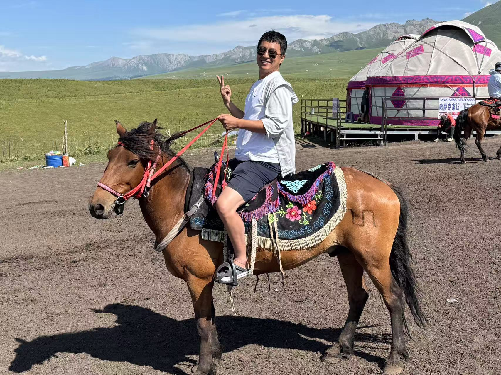

# 关于

&emsp;我是一名软件工程师，之前在腾讯从事过15年的游戏开发，现在进入新的领域做一些ToB桌面软件的开发。我的兴趣领域包括计算机操作系统、逆向分析、图形与动画、机器学习、游戏开发、计算理论以及编程语言。如果有需要，您可以通过laiyierjiangsu@163.com联系我！
# 社交
- [知乎](https://www.zhihu.com/people/laiyierjiangsu)
- [豆瓣](https://www.douban.com/people/KHacker)
- [Github](https://github.com/laiyierjiangsu)
- [Youtube](https://www.youtube.com/@yinlaiyier7070)
- [Twitter](https://x.com/guxiren)